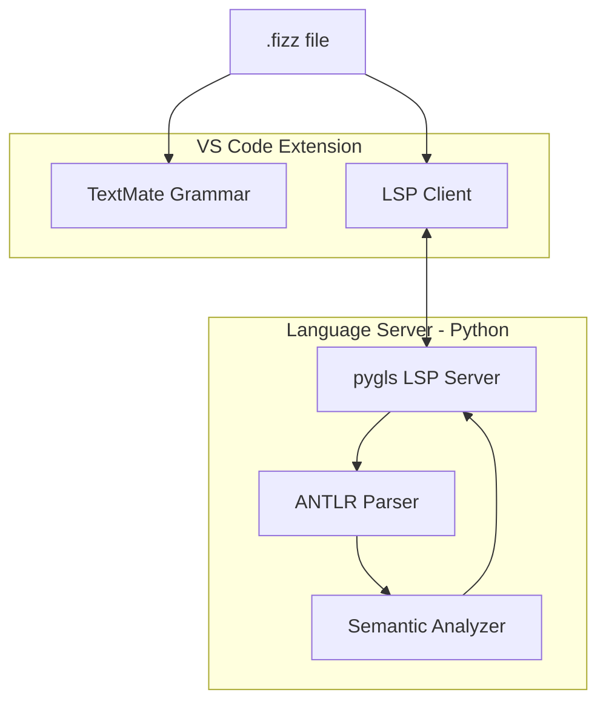

# Fizz Language Server Extension

## Architecture Overview

The Fizz language has **Python-like indentation-sensitive syntax** with INDENT/DEDENT tokens, making it challenging for standard TextMate grammars. The existing toolchain uses:

- **ANTLR4 parser** (Python) with custom `PythonLexerBase` for indentation handling
- **Protobuf AST** for intermediate representation
- **Go model checker** with Starlark for runtime evaluation

Assumptions for this plan (picked for good UX with low implementation cost):

- `uv`/`uvx` is available on PATH (team/local distribution).
- The extension is **self-contained**: it bundles the Fizz parser/visitor code it needs (no dependency on `vendor/fizzbee/parser` in the user’s workspace).



## Recommended Approach: Hybrid Python LSP

**Why Python**: The existing ANTLR parser handles indentation correctly via `PythonLexerBase`. Rewriting this in TypeScript or Go would be significant effort with high risk of edge case bugs.

**Components**:

1. **TextMate grammar** - Fast tokenization for syntax highlighting (keywords, strings, comments)
2. **Python LSP** (pygls) - Diagnostics, navigation, semantic tokens, completions

### Dependency management + launch strategy (uv)

- Ship the LSP as a Python package inside the extension (`server/`).
- On activation, the extension launches the server via `uv`:
  - Create/upgrade a cached environment in VS Code global storage (not per-workspace).
  - Pin exact versions via `uv.lock`.
  - Run `uv run python -m fizz_lsp`.
- UX goal: first launch installs deps once; subsequent launches are instant.

## Testing + acceptance criteria (non-optional)

**Rule**: every phase below must ship with **acceptance tests**. A phase is complete only when its acceptance tests pass locally/CI.\n

\n

We’ll use two layers:

\n

- **Server-level tests (fast, deterministic)**: Python `pytest` tests run the parser/analyzer directly and assert outputs (symbols, tokens, diagnostics) against fixtures.\n
- **Extension-level acceptance tests (end-to-end)**: VS Code extension tests open a `.fizz` fixture in an Extension Host, invoke LSP requests (or user-visible commands), and assert results.\n

\n

We will prefer **golden/snapshot fixtures** for:\n

- semantic tokens (token stream snapshots)\n
- diagnostics (range + message snapshots)\n
- document symbols (outline snapshots)\n

and **property tests** for:\n

- UTF-16 position conversions (round-trip invariants)\n
- YAML frontmatter offset invariants\n

## Extension Structure

```
fizz-lang/
├── package.json                 # VS Code extension manifest
├── language-configuration.json  # Brackets, comments, auto-close
├── syntaxes/
│   └── fizz.tmLanguage.json    # TextMate grammar
└── server/
    ├── pyproject.toml          # pygls, antlr4-runtime, protobuf, test deps
    ├── uv.lock                 # pinned deps
    ├── fizz_lsp/               # Python package
    │   ├── __main__.py          # LSP server entry point
    │   ├── server.py            # LSP wiring (pygls)
    │   ├── analysis/            # symbol table, semantic tokens, completions
    │   ├── fizz_parser/         # vendored ANTLR parser + bases + visitor
    │   └── proto/               # vendored generated protobufs (e.g. fizz_ast_pb2.py)
    └── tests/
```

## Key Features to Implement

### Phase 1: Syntax Highlighting (TextMate)

Fizz-specific keywords from [FizzLexer.g4](vendor/fizzbee/parser/FizzLexer.g4):

- **Control flow**: `atomic`, `serial`, `parallel`, `oneof`
- **Definitions**: `action`, `func`, `role`, `symmetric`, `init`
- **Verification**: `invariants`, `always`, `eventually`, `assertion`, `transition`
- **Quantifiers**: `any`, `exists`, `fair`, `require`
- **Composition**: `compose`, `refine`
- **Python keywords**: `if`, `else`, `elif`, `for`, `while`, `in`, `return`, `True`, `False`, `None`, etc.

Notes / limits:

- TextMate cannot truly model INDENT/DEDENT, so it’s best-effort for block structure and will be complemented by **semantic tokens**.

Acceptance tests (Phase 1):

- **TextMate token smoke**: open representative fixture files and assert that core scopes apply (keywords, strings, comments, labels).\n
  - Keep this lightweight; TextMate is inherently approximate. The “real” structure is validated via semantic tokens in Phase 3.5.\n

### Phase 2: LSP Diagnostics

Use the existing ANTLR parser to report:

- Syntax errors with precise line/column from a collecting `ErrorListener` (convert to LSP diagnostics)
- “Unexpected construct” errors from our IndexVisitor (avoid relying on `BuildAstVisitor` debug behavior)

Acceptance tests (Phase 2):

- **Broken-buffer tolerance**: diagnostics should not crash the server; ensure we can parse/return partial diagnostics on incomplete edits.\n
- **YAML frontmatter mapping**: diagnostic ranges align with user-visible lines when frontmatter is present.\n
- **UTF-16 correctness**: diagnostic ranges remain correct with non-ASCII in identifiers/strings/comments.\n

### Phase 3: Semantic Features

- **Go to Definition**: Actions, functions, roles, variables
- **Hover**: Show action signatures, role members
- **Completions**: Keywords, defined symbols, role members after `self.`
- **Document Symbols**: Outline of actions, functions, roles, invariants

Acceptance tests (Phase 3):

- **Go-to-definition**: from calls like `rm.Prepare()` navigates to the correct role method definition in fixtures.\n
- **Document symbols**: outline includes roles/actions/funcs/invariants with correct ranges.\n
- **Completion sanity**: after `self.` and after `<roleVar>.` returns role members (at least name-level, even if types are heuristic).\n

### Phase 3.5: Semantic Highlighting (semantic tokens)

Implement `textDocument/semanticTokens/full` using parse results + analysis:

- Highlight **definitions**: role names, action names, func names, invariant/assertion names.
- Highlight **calls**: receiver + method/function name for simple call patterns captured by the grammar (e.g. `rm.Prepare()`).
- Highlight **special runtime attrs**: `__id__` on roles; channel `.stub(...)` usage; constructor calls like `Participant()`.

Acceptance tests (Phase 3.5):

- **Semantic tokens snapshot**: for each fixture file, assert a stable semantic token stream (with token types/modifiers) and stable ranges.\n
- **Edit stability**: small edits shouldn’t cause token ranges to “jump” unrelatedly (use incremental versions in tests).\n

### Phase 4: Advanced (Optional)

- **Code Actions**: Quick fixes for common errors
- **Rename**: Symbol renaming across file
- **Integration with fizzbee CLI**: Run model checker, show counterexamples
- **ANTLR TypeScript conformance suite** (optional later): generate TS lexer/parser and cross-test token streams against Python for a shared fixture corpus

Acceptance tests (Phase 4 add-on):

- **Cross-runtime token stream equivalence**: for ASCII/BMP-only fixtures, token sequence (`type`, `text`) must match between Python and TS; positions compared only where encoding semantics match.\n
- **Indent/dedent correctness**: fixtures stress nested blocks, blank lines, and dedent-at-EOF.\n

## Optional later: TypeScript ANTLR generation + cross-runtime conformance

We can’t directly generate TypeScript from the current `.g4` files because they embed **Python-target actions** (e.g. `{self.HandleNewLine()}`) and set `superClass = PythonLexerBase/PythonParserBase`.

Plan for TS generation:

- Maintain `FizzLexer.ts.g4` / `FizzParser.ts.g4` that are rule-identical but with:
  - `superClass = TypeScriptLexerBase/TypeScriptParserBase`
  - embedded actions rewritten to TS (`this.HandleNewLine()` etc.)
- Generate with `antlr4ts`.
- Run a conformance suite that lexes/parses the same `.fizz` fixtures in both runtimes and compares outputs.

## TextMate scopes (coarse) + semantic tokens (precise)

TextMate should cover the obvious lexical categories; semantic tokens carry the “real” structure.

- **Definitions** (`action`, `func`, `init`, `role`, `assertion`, `invariants`, `compose`, `refine`): `keyword.other.definition.fizz`
- **Flow modifiers** (`atomic`, `serial`, `parallel`, `oneof`): `keyword.control.flow.fizz`
- **Quantifiers / constraints** (`any`, `exists`, `fair`, `require`): `keyword.operator.fizz`
- **Control** (`if`, `else`, `for`, `while`, `return`): `keyword.control.fizz`
- **Literals** (`True`, `False`, `None`): `constant.language.fizz`
- **Comments** (`#...`): `comment.line.number-sign.fizz`
- **Strings**: `string.quoted.*.fizz`
- **Labels** (`` `label` ``): `entity.name.label.fizz`

## Starlark-aware expression analysis (pragmatic)

Fizz stores many “embedded code” regions as strings (see `Expr.py_expr`, `PyStmt.code` in `proto/fizz_ast.proto`) which are later parsed/executed by Starlark (`go.starlark.net`) in the model checker.

For LSP UX (semantic tokens, navigation, hover) without pulling in Go tooling, do:

- Parse embedded expressions/statements with Python’s `ast` module as a **Starlark-subset approximation**:
  - It reliably finds `Name`, `Attribute`, and `Call` nodes (enough for highlighting/navigation).
  - While typing, parse often fails; fall back to lightweight heuristics (`x.y(`, `self.z`, etc.).
- Use this embedded-analysis output to:
  - provide member completions after `self.` / `<var>.`
  - identify call-sites for “go to definition”
  - add semantic tokens inside expressions (attributes, function calls, parameters)

If we later need higher fidelity, we can optionally add a Go helper using `go.starlark.net/syntax`, but that’s explicitly out-of-scope for “easy team-local” v1.

Acceptance tests (Starlark-aware analysis):

- **Expression parsing coverage**: fixtures cover `Name`, `Attribute`, `Call`, and nested constructs used in real specs.\n
- **Fallback behavior**: when Python `ast` parse fails (half-typed), heuristics still provide reasonable completions/tokens.\n

## Positioning + whitespace stability

Risk area: mapping between LSP UTF-16 positions and ANTLR/visitor 1-based line/column, especially with:

- YAML frontmatter stripping/padding (`parser/parser.py` adds leading `\n` to keep line numbers aligned)
- indentation-sensitive lexing (INDENT/DEDENT)
- non-ASCII content (LSP uses UTF-16 code units)

Mitigation: ship a focused test suite that asserts stable ranges under:

- YAML frontmatter + code
- tabs/spaces mixes (even if discouraged)
- Unicode identifiers and Unicode inside strings/comments
- edits in the middle of a file (diagnostics and go-to-def must not “jump”)

Acceptance tests (Positioning/whitespace):

- **Round-trip invariant**: LSP position -> offset -> position is stable for UTF-16.\n
- **Indentation edge fixtures**: mixed indent, blank lines, dedent at EOF, nested blocks.\n
- **Frontmatter fixtures**: varying frontmatter sizes, leading spaces before `---`, absence/presence.\n

## Performance model

Start simple and robust:

- Debounce parsing on `didChange` (e.g. 150–300ms idle) + cancel in-flight work on new version.
- Cache last-known-good parse + symbol table per document version.
- If current version doesn’t parse, continue serving outline/go-to-def from last-known-good, and show limited diagnostics (avoid flicker).

Partial parsing is possible later by re-parsing only the smallest indentation block containing the edit, but v1 should be debounce + caching first.

Acceptance tests (Performance):

- **Debounce behavior**: rapid change events result in <=1 parse per debounce window (server-side unit test).\n
- **No UI-stalls**: extension acceptance test ensures requests resolve within a reasonable timeout on medium fixtures.\n

## Key Implementation Files to Leverage

- [parser/parser.py](vendor/fizzbee/parser/parser.py) - Main parse entry point
- [parser/BuildAstVisitor.py](vendor/fizzbee/parser/BuildAstVisitor.py) - Reference for how Fizz constructs map to source locations (but we’ll build a smaller IndexVisitor for LSP)
- [parser/ErrorListener.py](vendor/fizzbee/parser/ErrorListener.py) - Reference for ANTLR error hooks (we’ll implement a collecting listener)
- [proto/fizz_ast.proto](vendor/fizzbee/proto/fizz_ast.proto) - AST structure with `SourceInfo` for positions